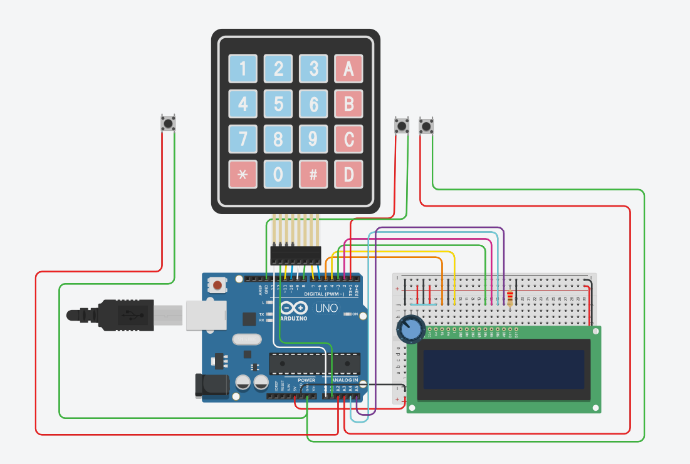

# 🎲 Pseudo-Random Number Generator - Tasodifiy Sonlar Generatori

## 📝 Loyiha tavsifi

Ushbu loyiha Pseudo tasodifiy sonlar generatorlarini yaratishga qaratilgan bo‘lib, Arduino platformasi asosida turli xil matematik algoritmlarni amalga oshirishni maqsad qiladi. Loyihada Tinkercad simulyatoridan foydalanilgan bo‘lib, qurilmaning sxemasi va ishlash prinsipi shu muhitda sinovdan o‘tkazilgan. Turli elementar va murakkab generatorlar yordamida sonlar va bitlar ketma-ketligi generatsiya qilinadi, bu esa kriptografiya, o‘yinlar va statistik modellashtirish kabi sohalarda qo‘llanilishi mumkin. Foydalanuvchi interfeysi orqali turli generatorlardan birini tanlash, parametrlarni sozlash va natijalarni LCD displeyda ko‘rish imkoniyati yaratilgan.

## 🔗 Tinkercad loyihasi

👉 [Loyihaga tashrif buyurish](https://www.tinkercad.com/things/hICXAOyO9nS-pseudorandomnumbergenerator)

## 🎰 Mavjud generatorlar

**Elementar generatorlar:**  
- Chiziqli  
- Nochiziqli  

**Murakkab generatorlar:**  
- RSA  
- Blum Blum Shub (BBS)  
- Blyum-Mikali  

**Siljitish registrlari asosidagi generatorlar:**  
- A5/1 algoritmi  

## 📟 Foydalanilgan qurilmalar

- Arduino UNO  
- 16x2 LCD displey  
- 4x4 Keypad  
- 3 ta tugma: Enter, Back, Delete  
- Potensial simlar va breadboard  

## 🖼️ Loyiha sxemasi

## 📁 Fayllar tarkibi

- `PseudoRandomNumberGenerator.ino` — Arduino kodi  
- `PseudoRandomNumberGenerator.docx` — Loyiha taqdimoti  
- `schematic.png` — Umumiy sxema  
- `README.md` — Loyiha haqida batafsil ma'lumot  

## 👨‍💻 Muallif

**Yusupov Samandarbek** | GitHub: [@samandar8283](https://github.com/samandar8283)

---

# 🎲 Pseudo-Random Number Generator

## 📝 Project Description

This project is focused on creating pseudo-random number generators, aiming to implement various mathematical algorithms based on the Arduino platform. The Tinkercad simulator was used to test the device’s circuit and operating principles in a virtual environment. Using a variety of elementary and advanced generators, sequences of numbers and bits are generated, which can be applied in fields such as cryptography, gaming, and statistical modeling. The user interface allows selecting one of the different generators, adjusting parameters, and displaying the results on an LCD screen.

## 🔗 Tinkercad project

👉 [Visit to project](https://www.tinkercad.com/things/hICXAOyO9nS-pseudorandomnumbergenerator)

## 🎰 Available Generators

**Elementary Generators:**  
- Linear  
- Non-linear  

**Advanced Generators:**  
- RSA  
- Blum Blum Shub (BBS)  
- Blum-Micali  

**LFSR-based Generators:**  
- A5/1 algorithm  

## 📟 Hardware Components

- Arduino UNO  
- 16x2 LCD Display  
- 4x4 Keypad  
- 3 Push-buttons: Enter, Back, Delete  
- Jumper wires and breadboard  

## 🖼️ Project Schematic

## 📁 File Structure

- `PseudoRandomNumberGenerator.ino` — Arduino source code  
- `PseudoRandomNumberGenerator.docx` — Project presentation  
- `schematic.png` — Circuit diagram  
- `README.md` — Project documentation  

## 👨‍💻 Author

**Yusupov Samandarbek** | GitHub: [@samandar8283](https://github.com/samandar8283)
